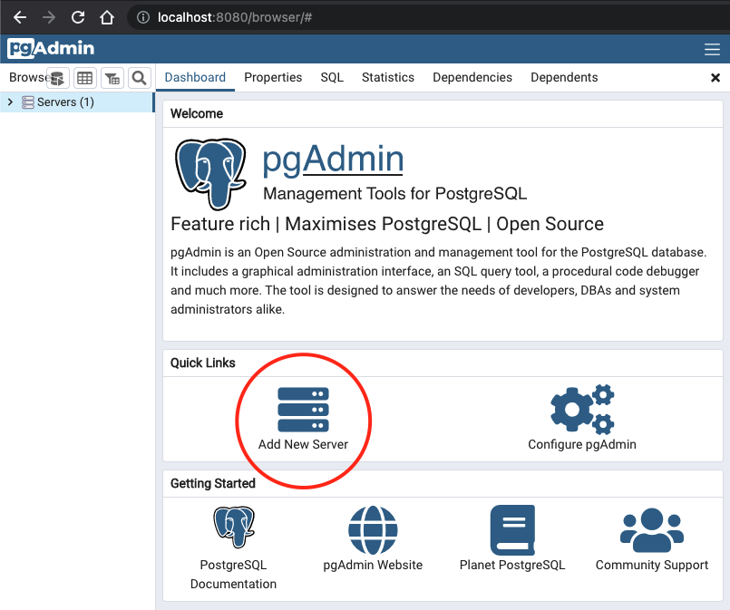
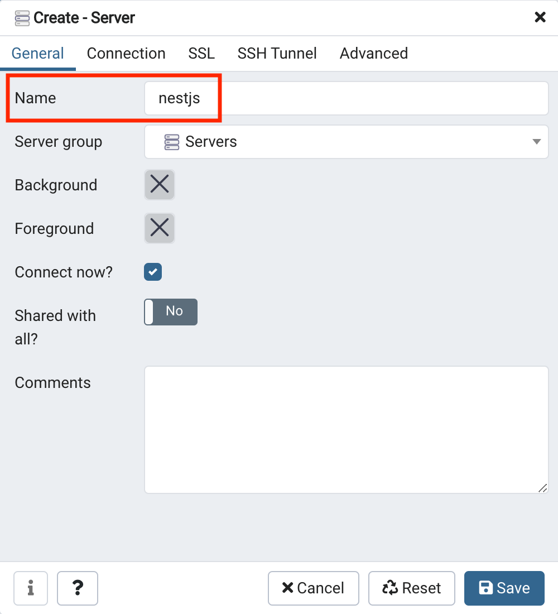
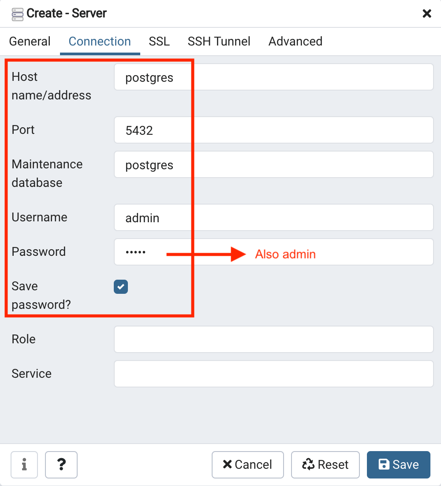
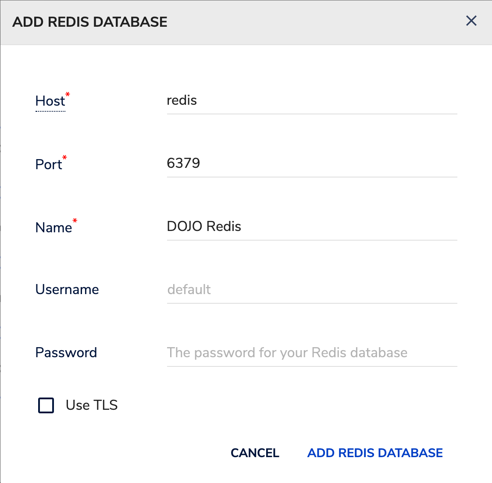

# DOJO Server

## Development

### Install dependencies

```bash
yarn install
```

### Run databases

```bash
docker compose up
```

PG Admin will be available at http://localhost:8080/
Redisinsight will be available at http://localhost:8001/

#### Creating the Postgres database

When running locally for the first time, the NestJS server might throw an error
like "nestjs database doesn't exist". To fix that, you will need to [open PG
Admin](http://localhost/8080), login with the credentials
`PGADMIN_DEFAULT_EMAIL` and `PGADMIN_DEFAULT_PASSWORD` defined in the
`docker.env` file and then, do as the following images suggest:

| 1 - Create a new server                      | 2 - Choose the DB name                          | 3 - Setup the connection                           |
| -------------------------------------------- | ----------------------------------------------- | -------------------------------------------------- |
|  |  |  |

#### Accessing the Postgres database

Just in case you want to inspect something without PG Admin. Not necessary.

`docker exec -it postgres bash`

`psql -d postgres -U admin`

`\dt`

#### Accessing Redisinsight

Open [Redisinsight](http://localhost:8001/), click on "Connect to a Redis Database" and use the same values as described in the image bellow.



### Run the server

```bash
yarn start:dev
```
